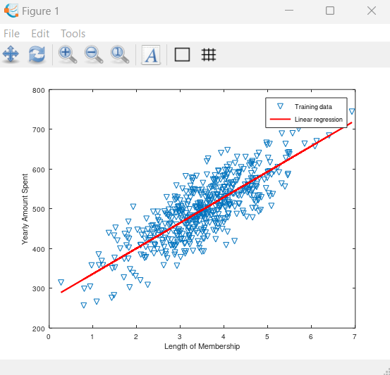

# Linear regression with Octave

## Table of Contents
* [General Info](#general-info)
* [Technologies Used](#technologies-used)
* [Features](#features)
* [Screenshots](#screenshots)
* [Setup](#setup)
* [Usage](#usage)
* [Project Status](#project-status)

## General Info
The project aim is to bring understing of linear regression into practice.  
It's good introduction for machine learning for beginners

## Technologies used
* GNU Octave, version 7.2.0

## Features
* displaying data in Octave enviroment
* calculating cost function
* drawing regression line
* using normal equation to confirm our regression line is correct
* showing predicted values for other inputs

## Screenshots

 

## Setup
Proceed to install [Octave](https://octave.org/download) to get started with the project.

## Project status
Although the project for now is finished, some further adjustments can be made.
